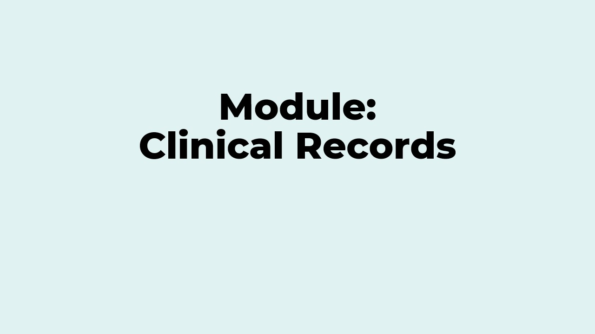

# 🗂️ Módulo - Sistema de Expedientes Digitales

  

En este repositorio se encuentra el sistema de expedientes clínicos de la Facultad de Psicología. El web service de la app funciona con render [aquí](https://expedientesclinicos.onrender.com).

## Presentación del proyecto

>  

- >[Documento de la presentación](docs/presentacion/ExpedientesClinicos.pdf)

## Video en inglés - Presentación final 

>  

## 🎯 Objetivos del proyecto 

Desarrollar un sistema para la gestión de **expedientes clínicos digitales**, enfocado en el control de **sesiones psicológicas**. Este sistema debe permitir registrar, consultar y actualizar información de los pacientes, así como la de sus respectivas sesiones.

## 📌 Alcances

* Interfaz intuitiva y amigable con el usuario 
* Autenticación y manejo de roles
  * Acceso basado en distintos roles dentro del personal de la clínica.
* Manejo de sesiones
  * Registro de detalles relevantes sobre las sesiones(fecha, número de sesión, etc).
  * Registro de notas y observaciones por parte del terapeuta.
* Exportación de información
  * Exportación de los expedientes (control de sesiones) en formato digital.

## 📍 Limitaciones 

* El sistema solo será accesible desde la intranet de la clínica o por personal autorizado.
* El sistema será de uso gratuito, integrado en la página web de la clínica.
* La actualización de la información será de manera manual.
* El sistema se desarrollará con enfoque en la clínica y sus necesidades.

## 💡 Propuesta de valor

El sistema de expedientes clínicos está pensado para mejorar el proceso del registro de información sobre cada paciente y sus expedientes clínicos.
Actualmente la clínica realiza los registros de manera física, sin la posibilidad de digitalizar dicha información para su posterior uso.
Esto conlleva un ineficiente flujo de trabajo, aumentando el tiempo necesario para el registro y resguardo de los expedientes, e incluso conllevando el riesgo de pérdida de los mismos.
Este nuevo sistema busca ofrecer una forma segura, centralizada y eficiente para el acceso y consulta de información, simplificando el flujo de trabajo, reduciendo el papeleo y mejorando la colaboración entre terapeutas y personal administrativo en el manejo de los expedientes.

## 📁 Estructura del repositorio

A continuación se describe brevemente qué contiene cada carpeta principal y su función dentro del proyecto.

- **`app/`**: Código fuente de la aplicación.
    - **`app/backend/`**: Backend Java (Spring Boot) del sistema.
        - `pom.xml`: Dependencias y configuración Maven del módulo backend.
        - **`src/main/`**: Código fuente Java del backend.
            - **`java/com/expedientesclinicos/`**:
                - `config/`: Configura las reglas CORS para la aplicación
                - `controller/`: Controladores REST.
                - `dto/`: Objetos de transferencia (requests, responses y resúmenes para la API).
                - `exception/`: Excepciones personalizadas y manejadores de errores.
                - `model/paciente`: Entidades JPA que representan tablas en la base de datos.
                - `repository/paciente`: Repositorios Spring Data JPA para acceso a la base de datos.
                - `service/`: Lógica de negocio y servicios para operar con entidades.
                - `ExpedientesClinicosApplication.java`
            - **`/resources/`**:
                - `static/`: Páginas html estáticas para la interfaz web.
                - `application.properties`: Configuración de Spring Boot y datasource.
    - `Dockerfile`: Compila la aplicación con Maven y crea una imagen de ejecución que contiene el JAR final.
    - `pom.xml`: Define el artefacto, dependencias y el plugin de Spring Boot
- **`docs/`**: Documentación del proyecto (alcances, requisitos, diagramas, historias de usuario, entregables y archivos de presentación).

## 📄 Documentación 

### 🌐 API

- >La documentación de la API se realiza con Swagger UI, se puede acceder desde [aquí](https://expedientesclinicos.onrender.com/swagger-ui/index.html#/).

### ✔️ Requisitos
- >[Requisitos Funcionales (RF)](docs/requisitos/requisitos_funcionales.md)

- >[Requisitos No Funcionales (RNF)](docs/requisitos/requisitos_no_funcionales.md)

### 📊 Priorización
- >[Método de prioridad](docs/priorizacion/metodos_prioridad.md)

- >[Requisitos/Historias de Usuario](docs/priorizacion/requisitos/requisitos.md)

- >[Análisis de factibilidad](docs/priorizacion/analisis_factibilidad.md)

### 📦 Artefactos
- >[Vista previa Casos de uso](docs/artefactos/diagrama_casos.png)

- >[Historias de usuario](docs/artefactos/historias_usuario.md)

### 🔍 Procesos de abstracción
- >[Estructura de clases](docs/artefactos/estructura_clases.md)

- >[Vista previa UML](docs/artefactos/diagrama_uml_preview.png)

### ⚙️ Procesos del proyecto
- >[Descripción](docs/proceso-proyecto/descripcion_proceso.md)

- >[Gestión](docs/proceso-proyecto/gestion_proceso.md)

- >[Contribuciones individuales](docs/proceso-proyecto/contribucion_individual.md)

### 📤 Entregas
- >[Primer entrega](https://github.com/Diego-Ceron/ExpedientesClinicos/tree/Primer-entrega)

- >[Segunda entrega](https://github.com/Diego-Ceron/ExpedientesClinicos/tree/Segunda-entrega)